# Re-evaluating Swiss reference dates and studying phenological shifts using four independent regional monitoring datasets

R pipelines for separating breeding and migratory bird populations in large-scale monitoring datasets, re-evaluating the Swiss *Stichdatum* (reference date) system against them, and tracking long-term phenological trends in migration timing.

**Authors:** Swastik Mandal¹, Nicolas Strebel²
&nbsp;·&nbsp; ¹ Indian Institute of Science Education and Research (IISER), Pune, India &nbsp;·&nbsp; ² Swiss Ornithological Institute, Sempach, Switzerland
&nbsp;·&nbsp; Correspondence: [swastik.mandal@students.iiserpune.ac.in](mailto:swastik.mandal@students.iiserpune.ac.in)

**Full write-up:** [`phenology_report.pdf`](phenology_report.pdf) (report) &nbsp;·&nbsp; [`final_presentation.pdf`](final_presentation.pdf) (slides)

---

## Overview

Central European monitoring schemes count breeding residents and passage migrants together at the same sites, which makes raw counts hard to interpret in terms of either group. To limit this, schemes such as the Swiss MHB define a species-specific **reference date** (*Stichdatum*, RD) — nominally the date after which breeders are expected to dominate counts over passage migrants — so that surveys conducted after the RD estimate breeding populations, not migration. Current RDs were fixed in the 1990s from field knowledge and the limited data available at the time.

Two lines of evidence suggest these RDs may now be outdated. First, climate-driven shifts in food phenology have been shown to move the migration timing of long-distance migrants, with short- and long-distance migrants responding differently. Second, national monitoring schemes across Central Europe have since accumulated multi-decade time series with far greater empirical resolution than was available when the RDs were first set. No systematic re-evaluation of the RDs using this accumulated data has been done — nor has it been asked whether such a re-evaluation would even reproduce if repeated independently in a neighbouring region.

This project re-evaluates the RDs using **four independent regional monitoring datasets** — Bavaria, two independent Baden-Württemberg surveys, and Switzerland — that differ in spatial/temporal coverage and in how they classify breeding vs. non-breeding sites, but share a common structure: repeated site visits through spring produce abundance counts that can be split into breeding and passage-migrant components. Each regional analysis fits smoothed phenological curves (LOESS or GAM) to the two components and extracts key timing metrics; a fifth analysis (`swissdata_phenology`) tracks how those metrics shift across nearly two decades of Swiss data, and a sixth (`acrossdata_results`) checks whether the four regional analyses agree with each other for species they share.

### Objectives

**Q1.** How do empirically estimated breeder-peak dates compare with the established reference dates?
**Q2.** Do the reference dates correspond to the departure of passage migrants, as intended?
**Q3.** Have breeder and migrant peak dates shifted over the years?
**Q4.** Are the answers to Q1–Q3 consistent across four independently collected datasets?

By addressing these at within-species, across-species, and across-dataset levels, the goal is to provide an empirical basis for revising RDs and for incorporating phenological trends and cross-dataset robustness into future survey-protocol design.

### Datasets

| Dataset | Region | Years | Sites | Species | Classification |
|---|---|---|---|---|---|
| [`bavaria_migration/`](bavaria_migration/) | Bavaria, DE | 2020–2024 | 244 | 138 processed (111–116 with RDs) | Territory count > 0 |
| [`swissdata_migration/`](swissdata_migration/) | Switzerland | 2021–2025 | 1 km² grid | 82–84 | Atlas code ≥ 4 and < 20, or = 50; 5 km buffer |
| [`swissdata_phenology/`](swissdata_phenology/) | Switzerland | 2007–2025 (15 windows) | 1 km² grid | 80–83 | Atlas code ≥ 4 and < 20, or = 50; 5 km buffer |
| [`wuerttemberg_1/`](wuerttemberg_1/) | Baden-Württemberg, DE | 2018–2023 | 303 | 130 (47 Kst / 17 Lst) | Behavioural codes, pooled across years |
| [`wuerttemberg_2/`](wuerttemberg_2/) | Baden-Württemberg, DE (Ornitho) | 2020–2025 | 342 | 134 (69 Kst / 28 Lst) | Atlas code B/C prefix, pooled across years |
| [`acrossdata_results/`](acrossdata_results/) | Cross-dataset comparison of the four regional analyses above | — | — | 16–19 shared species | Kst/Lst split, pairwise CCC & Bland–Altman |

*Kst = short-distance migrant, Lst = long-distance migrant (Swiss species-trait classification). Baden-Württemberg I's raw archive spans 2006–2023, but every record before 2018 lacks a valid survey date, so the usable window is 2018–2023 — considerably shorter than the Swiss trend series.*

## Key Results

The clearest, most uniform signal across every dataset and migratory strategy is that **reference dates do not reliably exclude the tail of the migrant wave**: `RD − migrant-50%-departure` is consistently negative (Table below), meaning surveys starting at the RD still catch a substantial residual migrant component — precisely the bias the RD was designed to avoid. This was the least ambiguous of the three within-dataset questions.

For **breeder phenology**, the picture depends on migratory strategy: long-distance migrants (Lst) show a robust, cross-validated pattern where the breeder peak consistently arrives *after* the RD (so the RD does capture the true peak); short-distance migrants (Kst) show genuinely mixed, region-dependent results — Bavaria and Swiss agree the RD captures the peak, but both Baden-Württemberg datasets disagree.

For **long-term trends**, the 2007–2025 Swiss series (80 species) shows short-distance migrants advancing both breeder and migrant peaks, while long-distance migrants show a divergent pattern: migration timing advances (−0.19 days yr⁻¹) but breeding activity is slightly delayed (+0.15 days yr⁻¹).

For **cross-dataset agreement (Q4)**, long-distance migrants are far easier to classify consistently: median pairwise correlation across the four datasets is **r = 0.65** for migrant-peak DOY in Lst species vs. essentially **r = 0.07** for Kst species. No species were flagged as consistent outliers — disagreement among short-distance migrants is diffuse, reflecting genuinely noisier signals rather than a handful of problem species.

| Ref − breeder peak | Ref − migrant peak | Ref − migrant 50% departure |
|---|---|---|
| Median (IQR) in days, negative = RD precedes the event | | |
| Lst: consistently negative (RD *follows* breeder peak) across all 4 datasets | Roughly even split, Lst skews negative | **Negative in every dataset & strategy** — the most consistent finding of the study |
| Kst: mixed sign, dataset-dependent | | |

*(Full per-dataset/per-strategy medians are in [Table 5 of the report](phenology_report.pdf), p. 17.)*

### Two case studies: a short- and a long-distance migrant

*Picus canus* (grey-headed woodpecker, **Kst**, RD = DOY 51 / 20 Feb) and *Jynx torquilla* (Eurasian wryneck, **Lst**, RD = DOY 122 / 2 May) were monitored by all four surveys and illustrate the Kst/Lst contrast described above.

**Picus canus** — breeder-peak estimates range DOY 70–88 and migrant-peak DOY 69–90 across the four datasets; all four agree the RD (day 51) arrives well *before* both peaks:

| Dataset | Breeder peak DOY | Migrant peak DOY | Ref − breeder peak | Ref − migrant peak |
|---|---|---|---|---|
| Bavaria | 81 | 70 | −30 | −19 |
| Swiss migration | 73 | 83 | −22 | −32 |
| Baden-Württemberg I | 70 | 69 | −19 | −18 |
| Baden-Württemberg II | 88 | 90 | −37 | −39 |

| 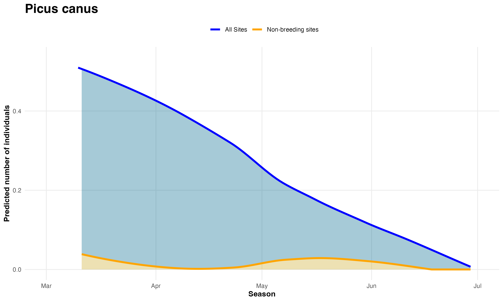 | 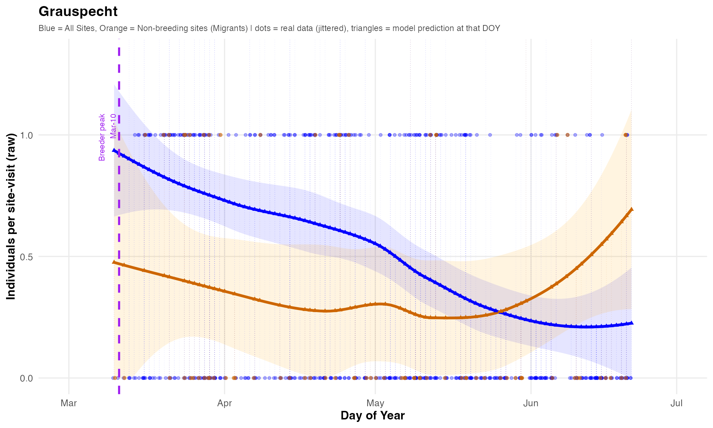 | 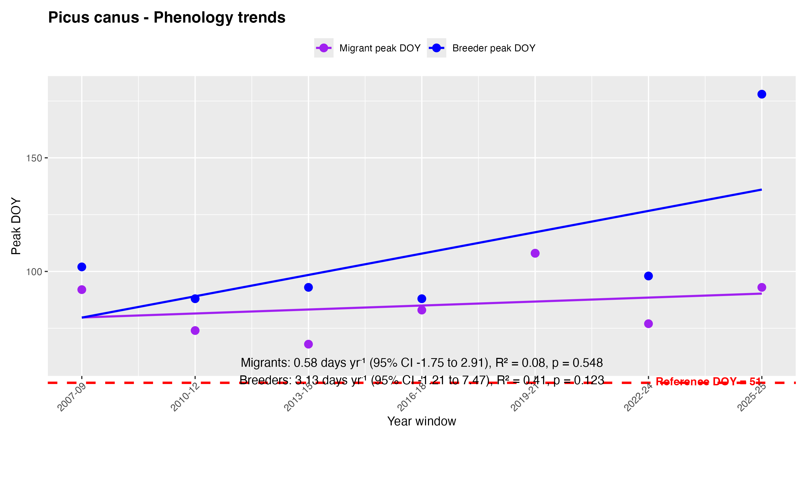 |
|---|---|---|
| Bavaria: all-sites vs. non-breeding curves | Baden-Württemberg I (*Grauspecht*): all-sites vs. migrant GAM fit | Swiss 2007–2025 trend: breeder peak advancing markedly, migrant peak only slightly |

**Jynx torquilla** — a tighter cross-dataset agreement: breeder-peak estimates span only 12 days and migrant-peak only 9 days across the four surveys:

| Dataset | Breeder peak DOY | Migrant peak DOY | Ref − breeder peak | Ref − migrant peak |
|---|---|---|---|---|
| Bavaria | 122 | 109 | 0 | 13 |
| Swiss migration | 113 | 113 | −9 | −9 |
| Baden-Württemberg I | 110 | 117 | −12 | −5 |
| Baden-Württemberg II | 113 | 118 | −9 | −4 |

| 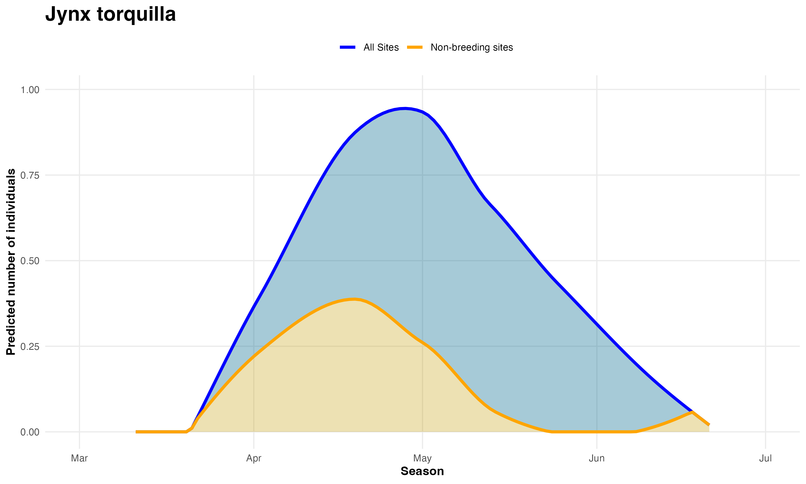 | 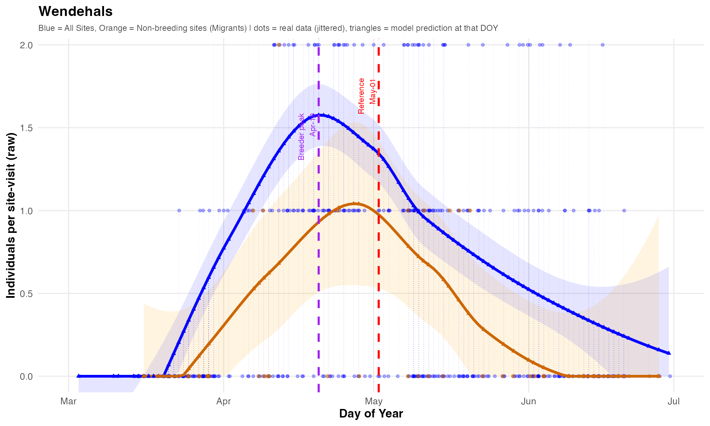 | 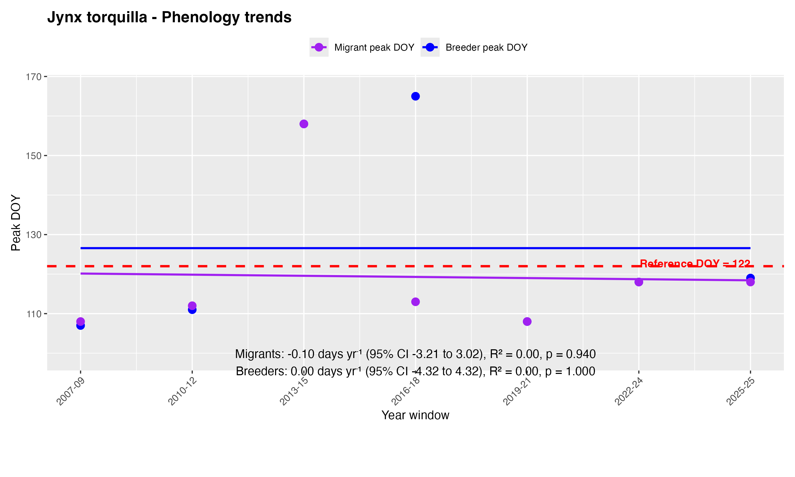 |
|---|---|---|
| Bavaria: all-sites vs. non-breeding curves | Baden-Württemberg I (*Wendehals*): all-sites vs. migrant GAM fit | Swiss 2007–2025 trend: both peaks essentially flat |

The full cross-dataset agreement heatmaps (CCC / Pearson r by metric and Kst/Lst), Bland–Altman panels, and the 16-species-common-to-all-four dot plots are in [`acrossdata_results/`](acrossdata_results/) and reproduced in the [report](phenology_report.pdf), Section 4.

---

## Repository Structure

```
Bird-Migration/
├── bavaria_migration/
│   ├── MhB_BY_Kontakte.xlsx             # Raw Bavarian survey data
│   ├── reference.csv                    # Expert reference dates (input)
│   ├── joined_table2.r                  # Step 1 — data integration
│   ├── new_table.r                      # Step 2 — per-species table generation
│   └── output/
│       ├── reference.csv                # Enriched reference table with computed DOYs
│       ├── reference_lst.csv            # LST-filtered migrant subset
│       ├── territory_separation.r       # Step 3 — breeding/non-breeding split
│       ├── migrant_curvemax.r           # Step 4 — LOESS fitting & date extraction
│       ├── breeder_vs_migrant.r         # Step 5a — per-species plots
│       ├── all_vs_nonbreeding.r         # Step 5b — per-species plots
│       ├── lst.r                        # Step 6 — LST filtering
│       ├── histogram.r                  # Step 7a — aggregate histograms
│       ├── scatter.r                    # Step 7b — scatter plots
│       ├── species_outputs/             # Per-species outputs (138 species)
│       │   └── [SpeciesName]/
│       │       ├── [SpeciesName].csv
│       │       ├── [SpeciesName]_yes_territory.csv
│       │       ├── [SpeciesName]_no_territory.csv
│       │       ├── all_vs_nonbreeders.png
│       │       ├── breeders_vs_nonbreeders.png
│       │       └── migrant_proportion_higher_max.png
│       ├── across_species_outputs/      # Cross-species histograms and scatter plots
│       └── lst_outputs/                 # Aggregate plots for LST-filtered subset
│
├── swissdata_migration/
│   ├── bb_clean.csv                     # Species list
│   ├── bb_doy.csv                       # Reference dates and computed DOY metrics
│   ├── territory_separation.r           # Step 1 — site classification and splitting
│   ├── nbb_final.r                      # Step 2 — OPM/SOPM, LOESS, date extraction
│   ├── nbpred.r                         # Step 3 — pentade→DOY phenology metric extraction
│   ├── histogram.r                      # Step 4 — aggregate histograms, by migratory strategy
│   ├── histogramReference-BreedingPeak_pred_5kmbuffer.png
│   ├── histogramReference-Migrant50_pred_5kmbuffer.png
│   └── species_outputs_atlas4/          # Per-species outputs (84 species), split by migratory strategy
│       ├── doy_summary_atlas4.csv       # Cross-species DOY summary
│       ├── hist_swiss_atlas4_ref_minus_breederpeak_by_zug.png
│       ├── hist_swiss_atlas4_ref_minus_migrant50_by_zug.png
│       ├── Kst/ · Lst/                  # Short-distance (Kst) / long-distance (Lst) migrants
│       └── [SpeciesName]/
│           ├── [SpeciesName].csv
│           ├── [SpeciesName]_bs.csv
│           ├── [SpeciesName]_nbs.csv
│           ├── [SpeciesName]_map(21-25).png
│           └── [SpeciesName]_prediction(21-25).png
│
├── swissdata_phenology/
│   ├── bb_doy.csv                       # Species reference dates
│   ├── phenology_peak_slopes.csv        # Cross-species slope summary
│   ├── hist_breeder_slope_by_zug.png    # Distribution of breeder peak-DOY trends, by Kst/Lst
│   ├── hist_migrant_slope_by_zug.png    # Distribution of migrant peak-DOY trends, by Kst/Lst
│   ├── phenologymc.r                    # Step 1 — per-species rolling-window analysis
│   ├── phenologymc2.r                   # Step 1 (parallel working copy of phenologymc.r)
│   ├── slope_summary.r                  # Step 2 — compile slopes across species, by migratory strategy
│   ├── plot_slopes.r                    # Step 3 — slope distribution histograms
│   └── species_phenology3/              # Per-species outputs (83 species), split by migratory strategy
│       └── Kst/ · Lst/                  # Short-distance (Kst) / long-distance (Lst) migrants
│           └── [SpeciesName]/
│               ├── [SpeciesName]_[window].png
│               ├── [SpeciesName]_trend.png
│               └── [SpeciesName]_phenology_shifts.csv
│
├── wuerttemberg_1/
│   ├── species_gam.R                    # Site classification + per-species GAM curve fitting
│   └── species_outputs_loess_visitbased/ # Per-species outputs, split by migratory strategy (German common names)
│       ├── Kst/ · Lst/                  # Short-distance (Kst, 47 spp.) / long-distance (Lst, 17 spp.) migrants
│       ├── Rebhuhn/                     # Grey partridge — flat folder, outside the Kst/Lst split
│       └── [SpeciesName]/
│           ├── [SpeciesName]_migrants.csv
│           ├── [SpeciesName]_breeders.csv
│           ├── [SpeciesName]_migrants_fit_check.png
│           ├── [SpeciesName]_breeders_fit_check.png
│           ├── [SpeciesName]_all_vs_migrants_fit_check.png
│           ├── all_vs_migrants.png
│           └── migrant_proportion_higher_max.png
│
├── wuerttemberg_2/
│   ├── species_gam.R                    # "Ever-breeder" site classification + per-species GAM fitting
│   └── species_outputs_loess_visitbased/ # Per-species outputs, split by migratory strategy (scientific names)
│       ├── Kst/ · Lst/                  # Short-distance (Kst, 69 spp.) / long-distance (Lst, 28 spp.) migrants
│       ├── Perdix_perdix/               # Grey partridge — flat folder, outside the Kst/Lst split
│       └── [SpeciesName]/
│           ├── [SpeciesName]_migrants.csv
│           ├── [SpeciesName]_breeders.csv
│           ├── [SpeciesName]_migrants_fit_check.png
│           ├── [SpeciesName]_breeders_fit_check.png
│           ├── [SpeciesName]_all_vs_migrants_fit_check.png
│           ├── all_vs_migrants.png
│           └── migrant_proportion_higher_max.png
│
└── acrossdata_results/                  # Cross-dataset agreement figures (Bavaria, Swiss, Württemberg 1 & 2)
    ├── dotplot/                         # Per-species reference-offset & peak-date dot plots
    │   ├── phenology_peaks_dotplot.pdf · phenology_peaks_dotplot_shared.pdf · dotplot_common19.pdf
    │   └── [w1bav | w1w2 | w1swiss | w2bav | w2swiss | bavswiss]/
    ├── scatterplot/                     # Pairwise, pooled, and dimensionality-reduction views
    │   ├── 4datasets/                   # Pooled scatterplots across the 19 shared species
    │   ├── parallel_coords/             # Parallel-coordinates plots across all four datasets
    │   ├── pca/                         # PCA biplots of offset metrics
    │   ├── radar/                       # Radar/spider charts of offset metrics
    │   ├── [Bavaria | Swiss | Württemberg | Württemberg_2]/  # Within-dataset metric-vs-metric scatterplots
    │   └── [w1bav | w1w2 | w1swiss | w2bav | w2swiss | bavswiss]/  # Pairwise dataset-vs-dataset scatterplots
    ├── bland_altman/                    # CCC / Bland–Altman agreement (pooled, zugwise, common19 — summary CSVs + PDFs at root)
    │   └── [bavswiss | w1bav | w1swiss | w1w2 | w2bav | w2swiss]/  # Per-pair Bland–Altman plots
    └── histogram/                       # Pooled reference-offset histogram across all 4 datasets
```

---

## Shared Methodology

All six analyses follow the same conceptual pipeline — classify sites/records as breeding or non-breeding, aggregate abundance per time unit, fit a smooth curve to each subset, and extract key dates — though the specific classification rule and smoother vary by dataset:

1. **Site/record classification** — each survey site (or, in Württemberg, each site×year) is classified as breeding or non-breeding. Bavaria and Swiss MHB use the maximum breeding-evidence **code** (atlas code or territory count) recorded there; the two Württemberg analyses instead use **behavioural flags** logged per visit (song, nesting material, feeding young, territorial aggression, etc.) — Württemberg 1 pools this across all years per site, Württemberg 2 uses an "ever-breeder" rule (any confirmed-breeding record across 2020–25 marks that site as breeding for all years)
2. **Spatial buffer** — Bavaria and Swiss MHB additionally exclude non-breeding sites within 5 km of any confirmed breeding site, reducing contamination of the migrant signal by birds commuting from nearby territories; the Württemberg analyses do not apply a spatial buffer
3. **OPM / SOPM** — the Observed Peak Maximum per site is summed across the network to produce a single phenological abundance index per time unit (day-of-year or pentade)
4. **Curve fitting** — Bavaria and Swiss MHB fit LOESS curves to breeding-site and non-breeding-site SOPM; both Württemberg analyses fit a GAM (`s(doy, bs="cs", k=10)`) instead. Key dates (peak, 50% departure) are extracted from each fitted curve and benchmarked against the same expert reference dates used in `bavaria_migration`. All four analyses now additionally group species by migratory strategy (`Kst`/`Lst`, short-/long-distance migrant, from a Swiss species-trait table) in their cross-species summary plots — for the two Württemberg analyses this split is baked into the per-species output folders themselves (`species_outputs_loess_visitbased/Kst/`, `/Lst/`), for the two Swiss analyses it appears in the `_by_zug` cross-species histograms
5. **Cross-dataset agreement** — `acrossdata_results` takes the peak dates and reference-date offsets produced by the four analyses above and tests whether they agree with each other across datasets, using concordance correlation (CCC) and Bland–Altman analysis

---

## bavaria_migration

Analysis of bird phenology in Bavaria using monitoring survey data, distinguishing breeding populations from migrants by separating site-year combinations with and without confirmed territory occupation. Key phenological dates (peak abundance, 50% migrant descent, 5% remnant) are derived per species and compared against standardised reference dates.

### Background

Monitoring schemes that count birds across a landscape capture a mixture of local breeders and passage migrants. Distinguishing these two components from count data alone is non-trivial. This project leverages territory records in the Bavarian Monitoring häufiger Brutvögel (MhB) dataset to separate breeding sites from non-breeding (transient/migrant) sites for each species. Phenological curves are then fitted independently to each group, and key dates are extracted to quantify how well expert-assigned reference dates correspond to the passage timing observed in the field.

### Data

| File | Description |
|---|---|
| `MhB_BY_Kontakte.xlsx` | Raw Bavarian bird monitoring survey data |
| `reference.csv` | Expert-assigned reference dates per species (EuringId, scientific name, date in `DD.MM.` format) |

### Methods

**1. Data Preparation** &nbsp;(`joined_table2.r`, `new_table.r`, `date_cleaning.r`)

Raw survey records are cleaned and a master survey table is constructed by taking the full Cartesian product of all unique site × date combinations and all species, then left-joining observed counts. Missing counts are filled with zero so that absences are explicitly represented. `new_table.r` filters to species present in `reference.csv` and writes one CSV per species to `output/species_outputs/`.

**2. Territory-Based Separation** &nbsp;(`output/territory_separation.r`)

Each site × year combination is classified as a **breeding site** (`yes_territory`) if the maximum number of territories recorded there in that year is greater than zero, and as a **non-breeding site** (`no_territory`) otherwise. The two subsets per species are written to separate CSVs.

**3. Phenological Curve Fitting** &nbsp;(`output/breeder_vs_migrant.r`, `output/all_vs_nonbreeding.r`)

LOESS smoothing (span = 0.75) is fitted independently to all sites combined, non-breeding sites only, and breeding sites only. Predictions are generated for DOY 60–190. Two per-species plots are produced: breeding vs non-breeding curves, and all-sites vs non-breeding with the migrant component shaded.

**4. Migrant Proportion Analysis** &nbsp;(`output/migrant_curvemax.r`)

For species on the migrant list, a migrant proportion time series is computed (non-breeding abundance / all-sites abundance per DOY). Three dates are extracted per species:

| Metric | Definition |
|---|---|
| `Peak_DOY` | Day of peak all-sites abundance |
| `Orange50_DOY` | Day non-breeding abundance descends to 50% of its peak |
| `Migrant5_DOY` | Day the migrant proportion drops to 5% |

**5. LST-Filtered Subset** &nbsp;(`output/lst.r`)

A semi-join filters `reference.csv` to species classified as migrants, producing `output/reference_lst.csv`. Aggregate visualisations are run on both the full set and this subset.

**6. Cross-Species Visualisations** &nbsp;(`output/histogram.r`, `output/scatter.r`)

Histograms of phenological date distributions and pairwise differences (reference vs computed dates) are saved to `output/across_species_outputs/` and `output/lst_outputs/`. A scatter plot relates expert reference DOY to observed Orange50_DOY across species.

| 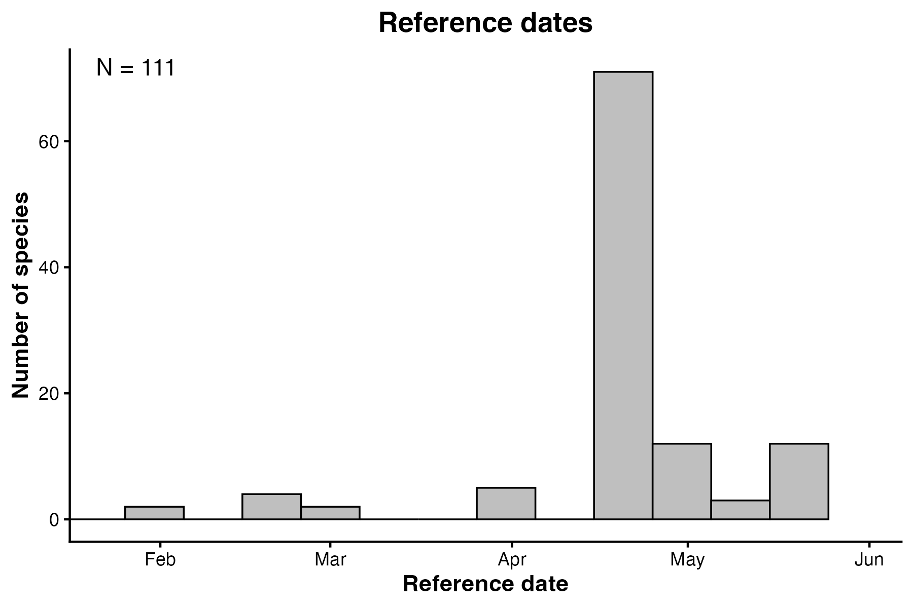 | 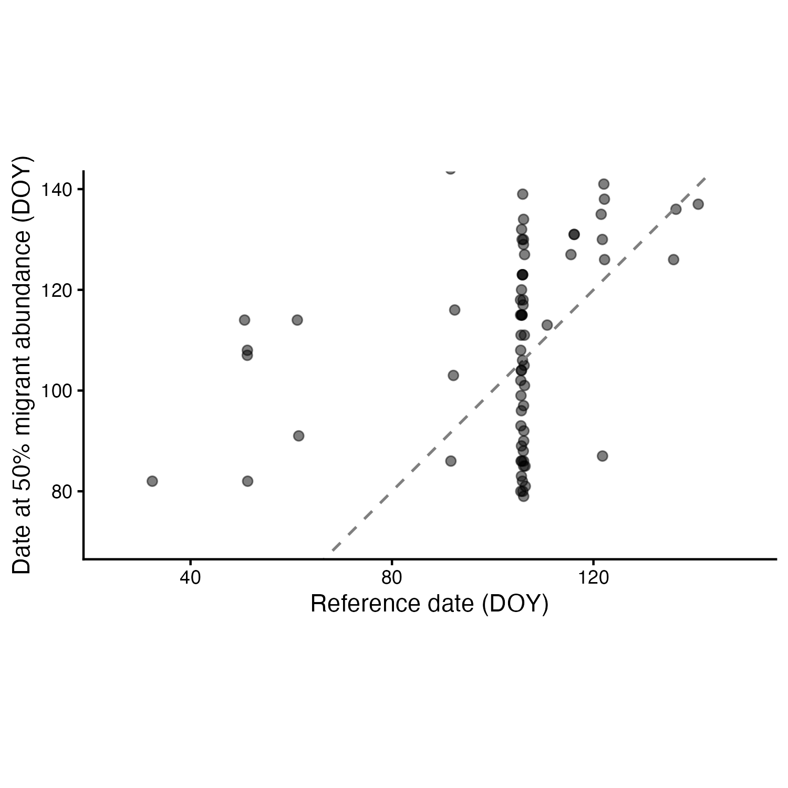 |
|---|---|
| Distribution of expert reference dates (DOY) | Reference DOY vs observed Orange50 DOY, across species |

### Requirements

```r
install.packages(c("tidyverse", "readxl", "lubridate"))
```

### Running the Analysis

```bash
# From bavaria_migration/
Rscript joined_table2.r
Rscript new_table.r

# From bavaria_migration/output/
Rscript date_cleaning.r
Rscript territory_separation.r
Rscript migrant_curvemax.r
Rscript breeder_vs_migrant.r
Rscript all_vs_nonbreeding.r
Rscript lst.r
Rscript histogram.r
Rscript scatter.r
```

---

## swissdata_migration

Separates breeding from migrant populations in the Swiss Breeding Bird Survey (MHB) using atlas-code-based site classification and a 5 km spatial buffer, then fits LOESS phenological curves to extract key migration timing metrics across 84 species.

### Background

The Swiss Breeding Bird Survey (MHB) records bird counts at fixed 1 km² grid squares on a pentade (5-day) schedule. Each observation is assigned an atlas code indicating the strength of breeding evidence. This project uses those codes to classify sites as breeding or non-breeding for each species, applies a spatial buffer to exclude non-breeding sites adjacent to confirmed breeding areas, and fits LOESS-smoothed phenological curves to the two subsets. The goal is to isolate the passage-migrant signal from the resident-breeder signal in count data collected during the spring migration and breeding season.

### Data

| File | Description |
|---|---|
| `bb_clean.csv` | Species reference list (EURING IDs, scientific names) |
| `bb_doy.csv` | Per-species expert reference dates and computed phenological metrics |
| `databb.csv` | Raw Swiss MHB count data — **not included** (proprietary; contact the Swiss Ornithological Institute) |

### Methods

**1. Site Classification and Buffering** &nbsp;(`territory_separation.r`)

Each 1 km² site is assigned a maximum atlas code from all observations for a given species across 2021–2025. Sites are classified as breeding (max code > 9 and < 20, or == 50) or non-breeding. Any non-breeding site within 5 km of a confirmed breeding site is then excluded.

**2. OPM and SOPM Computation** &nbsp;(`nbb_final.r`)

For each species and site class, the Observed Peak Maximum (OPM) per site per pentade per year is computed, then summed across sites to produce the SOPM. A complete pentade × year grid (pentades 10–37, years 2021–2025) is constructed with zeros for missing combinations.

**3. LOESS Curve Fitting and Date Extraction** &nbsp;(`nbb_final.r`, `nbpred.r`)

LOESS (span = 0.4) is fitted to breeding and non-breeding SOPM series. Three metrics are extracted per species:

| Metric | Definition |
|---|---|
| `non_breeding_peak` | Pentade of peak non-breeding SOPM |
| `migrant50_doy` | Day non-breeding SOPM descends to 50% of its peak |
| `breeder_peak_doy` | Pentade of peak breeding-site SOPM |

`nbpred.r` converts these pentade-resolution metrics to day-of-year and compiles them into `species_outputs_atlas4/doy_summary_atlas4.csv`.

**4. Aggregate Visualisations** &nbsp;(`histogram.r`)

Histograms summarise the distributions of `migrant50_doy` and `breeder_peak_doy` relative to expert reference dates, both pooled and split by migratory strategy (`hist_swiss_atlas4_ref_minus_breederpeak_by_zug.png`, `hist_swiss_atlas4_ref_minus_migrant50_by_zug.png`).

| 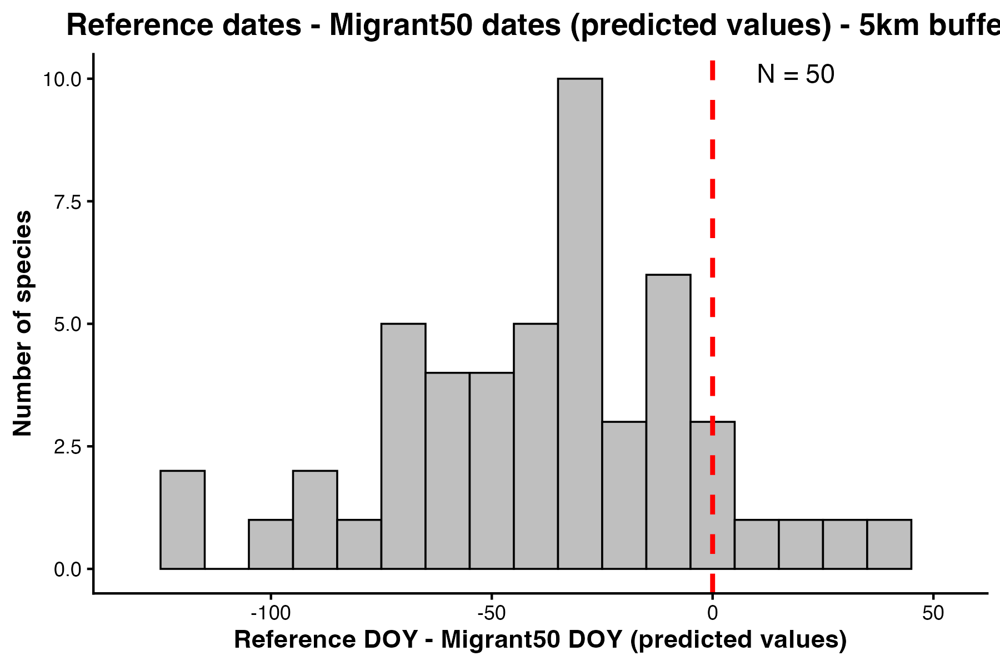 | 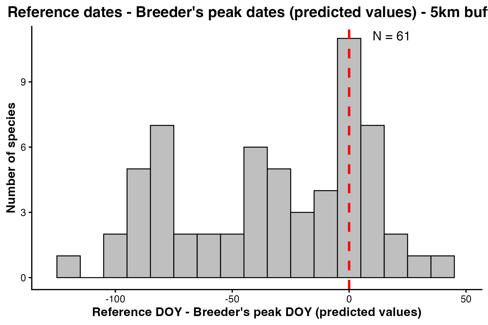 |
|---|---|
| Reference DOY vs migrant 50%-departure DOY | Reference DOY vs breeder peak DOY |

### Requirements

```r
install.packages(c("tidyverse", "ggridges", "data.table", "RPostgreSQL"))
```

### Running the Analysis

```bash
# From swissdata_migration/
mkdir species_outputs
Rscript territory_separation.r
Rscript nbb_final.r
Rscript histogram.r
```

---

## swissdata_phenology

Quantifies long-term shifts in spring migration and breeding phenology across 83 Swiss bird species using overlapping 5-year windows of Swiss MHB data (2007–2025), fitting LOESS curves at daily resolution with Monte Carlo pentade-jitter resampling.

### Background

Many migratory birds are shifting their arrival and departure timing in response to climate change. This project tracks how the peak timing of migrants and breeders has changed over nearly two decades in Switzerland. By analysing 15 overlapping 5-year windows, it captures a smooth temporal trajectory of phenological change per species and tests whether migratory and breeding populations are shifting at different rates — a question with implications for phenological mismatch and population dynamics.

### Data

| File | Description |
|---|---|
| `bb_doy.csv` | Per-species EURING IDs, names, and expert reference dates |
| `phenology_peak_slopes.csv` | Cross-species summary of migrant and breeder peak-DOY trend slopes |
| `databb.csv` | Raw Swiss MHB count data — **not included** (proprietary; contact the Swiss Ornithological Institute) |

### Methods

**1. Rolling Window Design** &nbsp;(`phenologymc.r`)

15 overlapping 5-year windows span 2007–2025 (2007–2011, 2008–2012, …, 2021–2025). Each window is treated as an independent phenological snapshot; the midpoint year (start + 2) is used as the x-axis coordinate for trend fitting.

**2. Site Classification and SOPM** &nbsp;(`phenologymc.r`)

Within each window, sites are classified using atlas codes (breeding: max code > 4 or == 50) with a 5 km buffer. OPM and SOPM are computed as in the migration analysis.

**3. LOESS Fitting at Daily Resolution** &nbsp;(`phenologymc.r`)

Within-pentade timing uncertainty is propagated using Monte Carlo resampling: for each of 250 iterations, each observation is assigned a random day within its pentade, LOESS (span = 0.2) is fitted to the resulting daily data, and predictions are averaged across iterations. Peak DOY is extracted from the mean curve for both migrant and breeder series per window.

**4. Trend Extraction** &nbsp;(`slope_summary.r`)

A linear model is fitted to peak DOY across the 15 windows for migrants and breeders separately:

```
Peak DOY ~ mid-year of window
```

The slope (days yr⁻¹), 95% confidence intervals, and R² are compiled per species in `phenology_peak_slopes.csv`, and species are split into `Kst`/`Lst` migratory-strategy subfolders (`species_phenology3/Kst/`, `/Lst/`) using the same Swiss trait table as the Württemberg analyses.

**5. Cross-Species Summary** &nbsp;(`plot_slopes.r`)

Histograms of migrant and breeder slopes across all species are plotted to compare overall direction and magnitude of phenological change, split by migratory strategy.

| 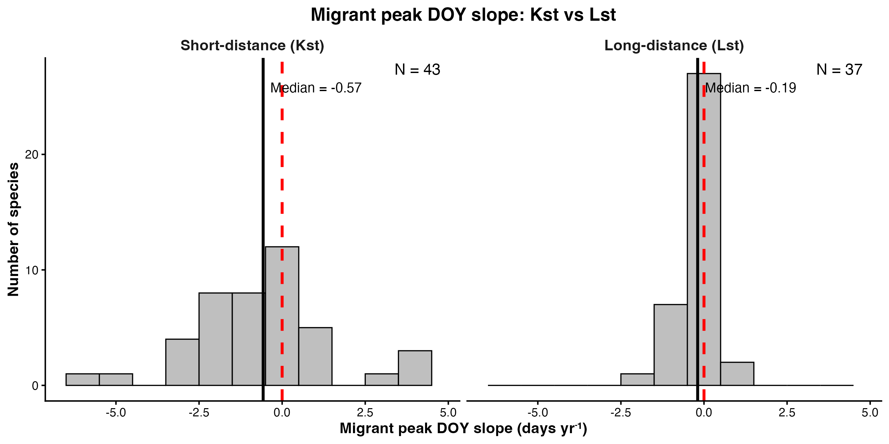 | 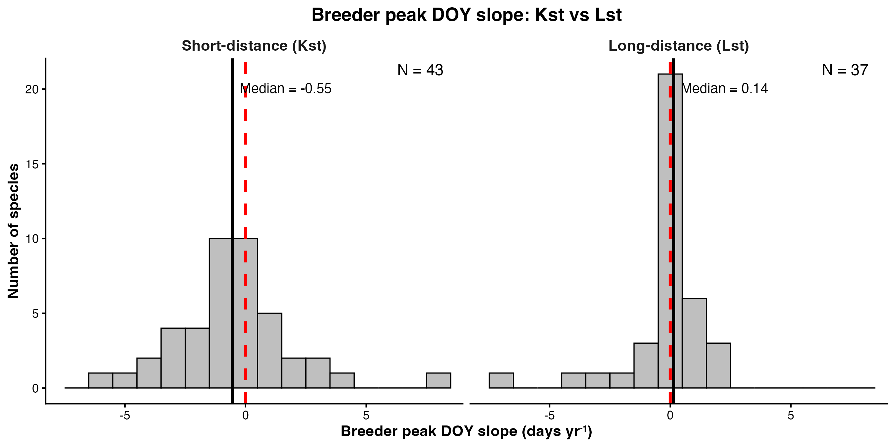 |
|---|---|
| Migrant peak DOY trend (days yr⁻¹), by Kst/Lst | Breeder peak DOY trend (days yr⁻¹), by Kst/Lst |

### Requirements

```r
install.packages(c("tidyverse", "broom"))
```

### Running the Analysis

```bash
# From swissdata_phenology/
Rscript phenologymc.r
Rscript slope_summary.r
Rscript plot_slopes.r
```

---

## wuerttemberg_1

Analysis of bird phenology in Baden-Württemberg using the "Monitoring häufiger Brutvögel" (MhB) survey, separating breeding sites from migrant/passage sites using visit-level behavioural evidence and fitting GAM phenological curves per species, grouped by migratory strategy.

### Background

The raw MhB survey table nominally spans 2006–2023, but every record from 2006–2017 has an empty date field and is dropped during cleaning — so the usable analysis window is effectively **2018–2023**. Site classification here does not rely on a fixed atlas code but on behavioural flags recorded at each visit (singing, warning/alarm calls, aggressive territorial interactions, nesting material, feeding of young, active nests, juveniles, and territory records); a site is treated as a confirmed-breeding site for a species if any visit across the whole period shows one of these flags. Per-species curves are fitted with a GAM (`species_gam.R`) and benchmarked against the same expert reference dates used in `bavaria_migration`, joined via a German common-name → scientific-name lookup. Output folders and species names use the German common names directly (e.g. `Amsel`, `Rotkehlchen`). Species are further split into short-distance (`Kst`, 47 species) and long-distance (`Lst`, 17 species) migrants using a Swiss species-trait reference table, since the two strategies are expected to show different passage timing and different agreement with the reference dates; one species (`Rebhuhn`, grey partridge) sits outside this split in a flat top-level folder.

### Data

| File | Description |
|---|---|
| `species_outputs_loess_visitbased/[SpeciesName]/[SpeciesName]_migrants.csv`, `_breeders.csv` | Per-species, per-DOY aggregated abundance for non-breeding and breeding sites |
| `species_outputs_loess_visitbased/[SpeciesName]/*_fit_check.png` | Per-species GAM fit diagnostics for the breeding, migrant, and combined curves |

The raw MhB export and the cleaning script are kept outside this repo; only the GAM-based results are published here. (The `species_outputs_loess_visitbased` folder name reflects an earlier LOESS-based comparison pipeline — `species_gam.R` itself still fits a GAM.)

### Methods

**1. Site Classification** &nbsp;(external prep step, not included here)

Each site is labelled a confirmed-breeding site for a species if any visit across 2018–2023 recorded singing, alarm/warning behaviour, aggressive territorial interaction, nesting material, feeding of young, an active nest, juveniles, or a territory — otherwise it is treated as non-breeding (migrant).

**2. Per-Species GAM Curve Fitting** &nbsp;(`species_gam.R`)

For species with ≥30 records, day-of-year is restricted to 59–181. Counts are aggregated per DOY across breeding and non-breeding sites separately, and a GAM (`n ~ s(doy, bs = "cs", k = 10)`, Gaussian family) is fitted to each subset. Two dates are extracted per species: the breeding-curve peak DOY, and the DOY on which the non-breeding (migrant) curve first descends to ≤50% of its peak. A scaled migrant-proportion curve (non-breeding ÷ all-sites, where the scaled all-sites curve is at least 6% of its own peak) is also produced, alongside `_fit_check.png` diagnostic plots for each fitted curve.

**3. Cross-Species Summaries by Migratory Strategy** &nbsp;(external step, not included here)

Species are joined to a Swiss trait table for their `Kst`/`Lst` migratory-strategy code, and the reference-offset and year-on-year slope distributions are plotted separately for each group.

| 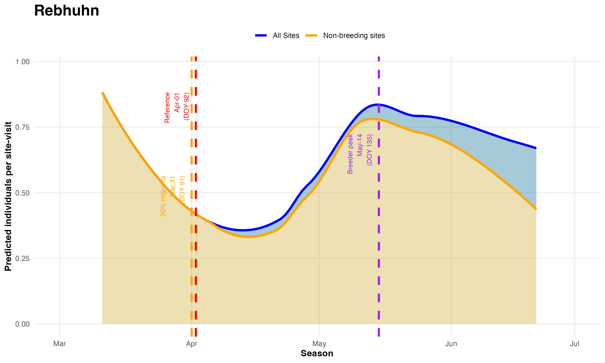 | 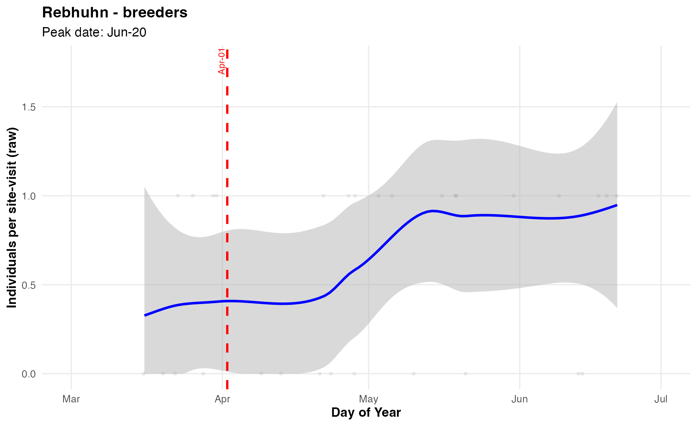 |
|---|---|
| *Rebhuhn* (grey partridge) — all-sites vs non-breeding-site GAM curves | *Rebhuhn* — breeding-curve GAM fit diagnostic |

### Requirements

```r
install.packages(c("tidyverse", "lubridate", "mgcv"))
```

### Running the Analysis

```bash
# From wuerttemberg_1/ — requires the cleaned MhB dataset and Bavaria's reference.csv
Rscript species_gam.R
```

---

## wuerttemberg_2

A second, independent Baden-Württemberg MhB/Ornitho survey (2020–2025), analysed with the same breeding/migrant-separation and GAM curve-fitting approach as `wuerttemberg_1`, to serve as a partial replication of that analysis over a more recent, partially overlapping time window.

### Background

Unlike `wuerttemberg_1`'s per-visit behavioural flags, site classification here uses an "ever-breeder" rule based on breeding-atlas codes: if any record at a site for a species across 2020–2025 carries a confirmed/probable-breeding atlas code (a `B`/`C`-prefixed code), that site is treated as a breeding site for that species for the full period; all other sites are treated as non-breeding (migrant). As in `wuerttemberg_1`, a GAM is fitted to the breeding and non-breeding abundance curves per species, key phenological dates are extracted and benchmarked against the Bavaria reference dates, and species are grouped by migratory strategy (`Kst`, 69 species; `Lst`, 28 species) — unlike `wuerttemberg_1`, species folders here keep their scientific names, with one species (`Perdix_perdix`) outside the split in a flat top-level folder.

### Data

| File | Description |
|---|---|
| `species_outputs_loess_visitbased/[SpeciesName]/[SpeciesName]_migrants.csv`, `_breeders.csv` | Per-species, per-DOY aggregated abundance for non-breeding and breeding sites |
| `species_outputs_loess_visitbased/Kst/`, `species_outputs_loess_visitbased/Lst/` | Same per-species outputs, grouped by short- vs long-distance migrant |
| `species_outputs_loess_visitbased/[SpeciesName]/*_fit_check.png` | Per-species GAM fit diagnostics for the breeding, migrant, and combined curves |

The raw Ornitho export and the cleaning script are kept outside this repo; only the GAM-based results are published here. (As with `wuerttemberg_1`, the `species_outputs_loess_visitbased` folder name reflects an earlier LOESS-based comparison pipeline — `species_gam.R` itself still fits a GAM.)

### Methods

**1. "Ever-Breeder" Site Classification** &nbsp;(external prep step, not included here)

A site is labelled a breeding site for a species if any record there between 2020 and 2025 carries a `B`- or `C`-prefixed breeding-atlas code; this label is applied to that site for the species across the whole period. Day-of-year is restricted to 59–181.

**2. Per-Species GAM Curve Fitting** &nbsp;(`species_gam.R`)

For species with ≥30 records, breeding- and non-breeding-site counts are aggregated per DOY and a GAM (`n ~ s(doy, bs = "cs", k = 10)`, Gaussian family) is fitted to each. The breeding-curve peak DOY and the non-breeding curve's 50%-descent DOY are extracted and compared to the Bavaria reference date for that species.

**3. Migratory-Strategy Grouping** &nbsp;(external step, not included here)

Species are split into `Kst`/`Lst` subfolders using the same Swiss trait table as `wuerttemberg_1`.

| 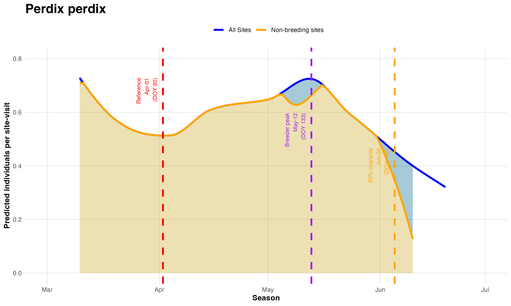 |  |
|---|---|
| *Perdix perdix* — all-sites vs non-breeding-site GAM curves | *Perdix perdix* — scaled migrant-proportion curve |

### Requirements

```r
install.packages(c("tidyverse", "lubridate", "mgcv"))
```

### Running the Analysis

```bash
# From wuerttemberg_2/ — requires the cleaned Ornitho dataset and Bavaria's reference.csv
Rscript species_gam.R
```

---

## acrossdata_results

Checks whether the phenological metrics produced by the four regional analyses (`bavaria_migration`, `swissdata_migration`, `wuerttemberg_1`, `wuerttemberg_2`) agree with one another for species monitored by more than one survey — this repo folder holds only the resulting figures; the underlying R scripts and intermediate summary tables are kept outside this repo.

### Background

Each regional analysis independently produces, per species, an expert reference DOY plus a computed breeder-peak DOY, migrant-peak DOY, and migrant-50%-descent DOY. Because the four surveys are collected and processed completely independently, agreement between them is not guaranteed — this analysis pools their outputs and tests reproducibility in two ways: (1) whether the *offset* between reference date and computed peak dates behaves consistently across datasets, and (2) whether the raw peak-date estimates themselves are concordant across datasets for shared species. Agreement is quantified with Lin's concordance correlation coefficient (CCC) and visualised with Bland–Altman plots, computed pairwise across all six dataset combinations (Bavaria, Swiss, Württemberg 1, Württemberg 2) and split by migratory strategy (`Kst`/`Lst`) where noted — referred to as the "zugwise" comparisons. A stricter version restricts the comparison to the **19 species present in all four datasets** ("common19").

### Contents

| Folder | Contents |
|---|---|
| `dotplot/` | Per-species dot plots of reference-offsets and raw peak dates, one dot per dataset per species, for species common to all 4 datasets (root-level PDFs) and for each dataset pair (`w1bav`, `w1w2`, `w1swiss`, `w2bav`, `w2swiss`, `bavswiss`) |
| `scatterplot/` | Scatterplots of one offset metric against another within a dataset (`Bavaria/`, `Swiss/`, `Württemberg/`, `Württemberg_2/`), dataset-vs-dataset for a given metric (`w1bav`, `w1w2`, `w1swiss`, `w2bav`, `w2swiss`, `bavswiss`), a combined 4-dataset panel restricted to the 19 shared species (`4datasets/`), parallel-coordinates plots across all four datasets (`parallel_coords/`), and PCA (`pca/`) / radar (`radar/`) views of the offset metrics |
| `bland_altman/` | CCC and Pearson-r heatmaps with paired Bland–Altman panels (root-level PDFs + summary CSVs), for the raw peak dates (pooled, per dataset pair), the reference-offsets split by migratory strategy ("zugwise"), and the same split restricted to the 19 shared species ("common19") |
| `histogram/` | Pooled histogram of reference-offsets across all species in all 4 datasets |

### Methods

**1. Build the cross-dataset table** — Each regional pipeline's per-site/year/DOY abundance data is re-fit (GAM for Bavaria/Württemberg 1/2, LOESS for Swiss) to extract peak and 50%-descent DOYs, joined to each dataset's own reference DOY, into one table keyed by dataset × species × migratory strategy.

**2. Dot plots and scatterplots** — Reference-offsets and raw peak dates are compared per species across datasets (all-four and pairwise), and one offset metric is plotted against another to check internal consistency within and across datasets.

**3. Concordance (CCC) and Bland–Altman analysis** — For every dataset pair, Lin's concordance correlation coefficient

$$\mathrm{CCC} = \frac{2\,\sigma_{xy}}{\sigma_x^2 + \sigma_y^2 + (\mu_x - \mu_y)^2}$$

(with a 2000-resample bootstrap 95% confidence interval) and a classic Bland–Altman bias/limits-of-agreement analysis are computed for the raw peak dates (pooled across migratory strategy) and separately for the reference-offsets split by `Kst`/`Lst` ("zugwise"), plus a version restricted to the species shared by all four datasets ("common19"). Species that fall outside the limits of agreement in every pairwise comparison they appear in are flagged as consistent outliers — in practice, none are: disagreement among short-distance migrants is diffuse across the whole Kst pool rather than driven by a handful of species.

| 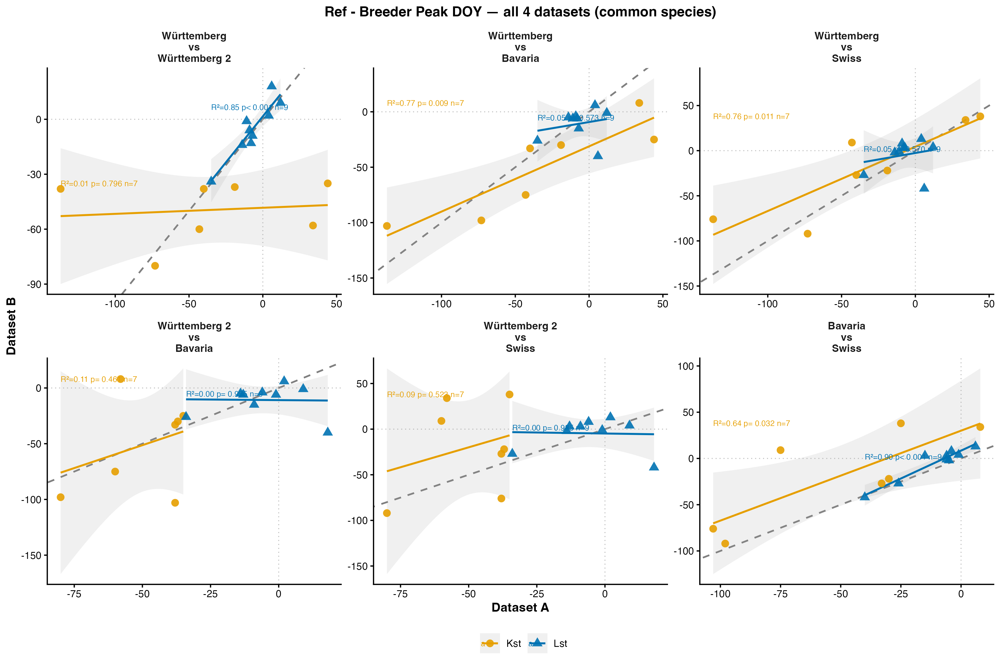 | 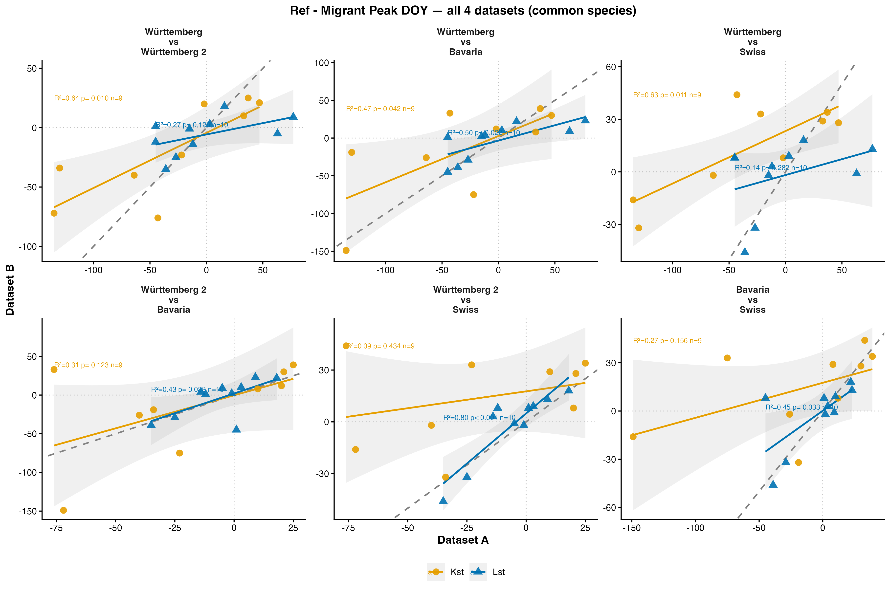 |
|---|---|
| Reference-minus-breeder-peak offset across all 4 datasets (shared species) | Reference-minus-migrant-peak offset across all 4 datasets (shared species) |

**Median pairwise Pearson r across the six dataset-pair comparisons, by metric and migratory strategy** (species common to all four datasets):

| Metric | Kst | Lst |
|---|---|---|
| Migrant peak DOY | 0.07 | 0.65 |
| Breeder peak DOY | 0.46 | 0.51 |
| Ref − migrant peak | 0.28 | 0.74 |
| Ref − breeder peak | 0.59 | 0.66 |

Long-distance migrants agree far more consistently across independently collected datasets than short-distance migrants do, for every metric — most starkly for migrant-peak DOY (r = 0.65 vs. 0.07).

### Requirements

```r
install.packages(c("tidyverse", "lubridate", "mgcv", "RColorBrewer", "ggrepel", "scales"))
```

---

## Conclusions

**Q1 — Breeder phenology.** Whether the RD precedes or follows peak breeding activity depends on migratory strategy. Long-distance migrants show a robust, cross-validated pattern: breeder-peak DOY consistently arrives after the RD, so the RD captures a true peak. Short-distance migrants show genuinely mixed, region-dependent results — Bavaria and Swiss agree the RD captures the peak, Baden-Württemberg I and II mostly disagree — suggesting any Kst revision may need to be spatially calibrated rather than uniform.

**Q2 — Migrant phenology.** RDs fail to align with migrant *departure* in almost every dataset and migratory-strategy category: `RD − migrant-50%` is consistently negative, meaning surveys starting at the RD still include a substantial residual migrant component — the exact bias the RD concept was meant to avoid. This is the least ambiguous, most uniformly reproduced finding of the study.

**Q3 — Long-term trends.** Over 2007–2025 (Swiss data only), short-distance migrants show a consistent negative (advancing) trend for both breeder and migrant peaks; long-distance migrants show a divergent pattern — migration advancing (−0.19 days yr⁻¹) while breeding activity is slightly delayed (+0.15 days yr⁻¹), consistent with Lst species being constrained by fixed departure cues at distant wintering grounds while Kst species track local conditions more tightly. These trend estimates currently come from a single (Swiss) time series and should be treated as suggestive until a comparable multi-decade series exists for Bavaria or Württemberg.

**Q4 — Cross-dataset agreement.** The answers to Q1–Q3 are not uniformly reproducible across independently collected datasets, and the degree of reproducibility itself varies systematically with migratory strategy: long-distance migrants classify consistently and agree well across datasets; short-distance migrants show weak median agreement for every metric, diffused across the whole Kst pool rather than concentrated in a few problem species — plausibly reflecting smaller Kst subpopulations or greater sensitivity to the site-classification rule used.

Taken together, these results show that many reference dates warrant empirical reassessment, most unambiguously with respect to migrant departure timing (Q2). Any revision should account for cross-dataset agreement: for long-distance migrants, where validation is strong, a single revised RD per species looks feasible; for short-distance migrants, weak cross-dataset agreement plus region-dependent Q1 results point toward locally calibrated RDs instead.

---

## Acknowledgements

The authors thank the Swiss Ornithological Institute for access to the ornitho.ch atlas monitoring data, the [Landesbund für Vogel- und Naturschutz in Bayern e.V. (LBV)](https://www.lbv.de), which coordinates the MhB on behalf of the Bavarian State Office for the Environment, and NABU-Vogelschutzzentrum, which coordinates the MhB on behalf of the Landesanstalt für Umwelt (LUBW). We are grateful to all volunteer observers whose survey effort forms the backbone of these long-term datasets. [Nicolas Strebel](https://www.vogelwarte.ch) (Swiss Ornithological Institute) provided data access, domain expertise, and conceptual guidance throughout.

## Data and Code Availability

Analysis code and result outputs for all six component analyses are in this repository. Raw monitoring data are held by the respective regional monitoring agencies (LBV for Bavaria, LUBW/NABU-Vogelschutzzentrum for Baden-Württemberg, the Swiss Ornithological Institute for Switzerland) and are available on reasonable request, subject to data-sharing agreements — hence the `*.xlsx` / `databb.csv` raw-data files are excluded from version control (see [`.gitignore`](.gitignore)).
