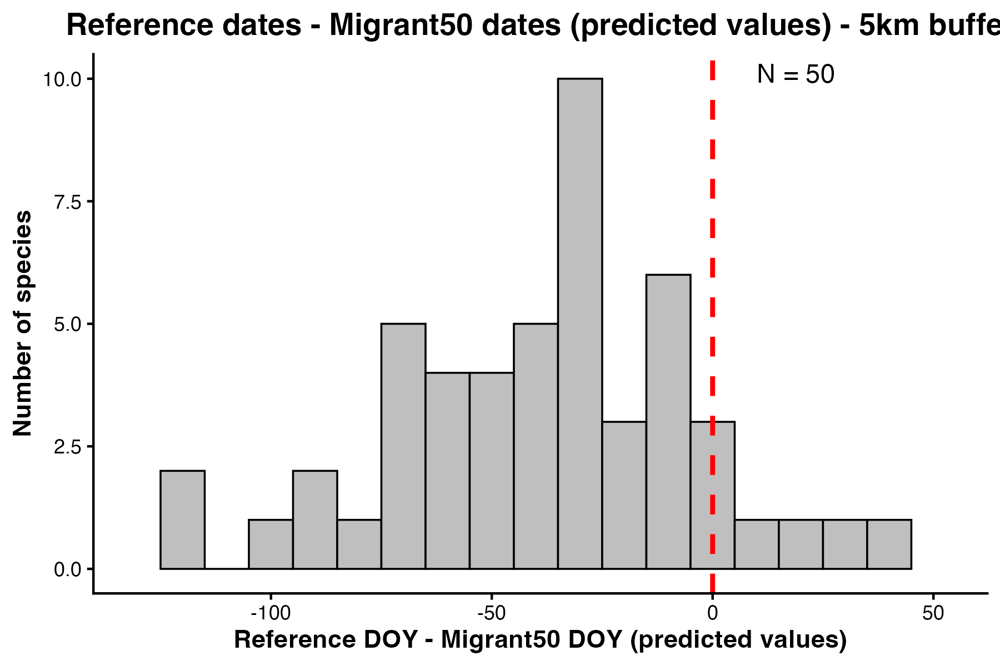
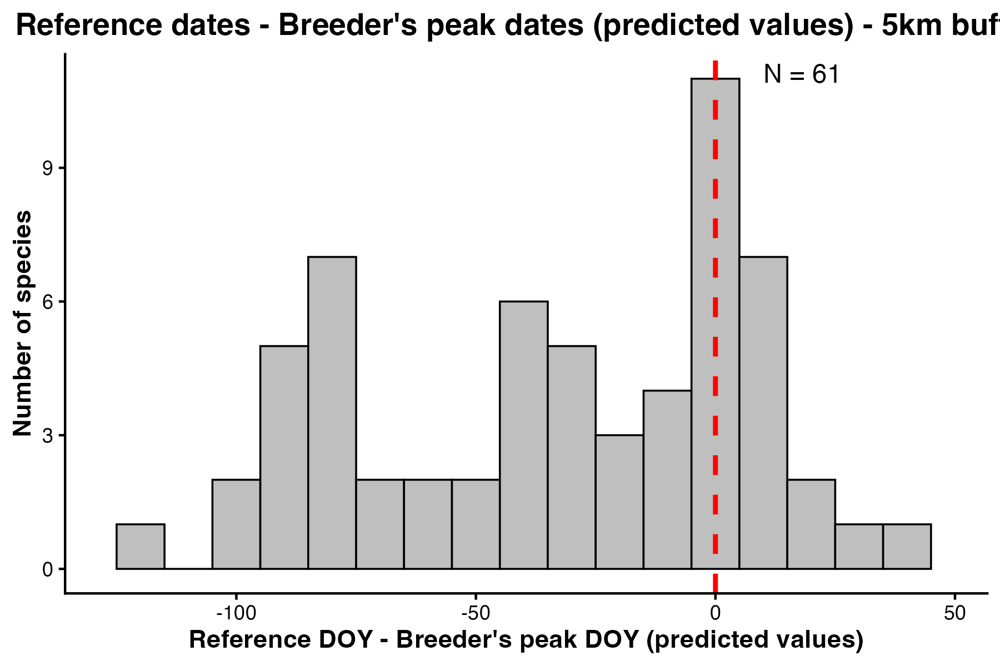

# Swiss Bird Migration — Breeding vs Migrant Separation (2021–2025)

Separates breeding from migrant populations in the Swiss Breeding Bird Survey (MHB) using atlas-code-based site classification and a 5 km spatial buffer, then fits LOESS phenological curves to extract key migration timing metrics across ~150 species.

---

## Authors

**Swastik Mandal** — Indian Institute of Science Education and Research (IISER), Pune  
*(analysis and scripts)*

**Nicolas Strebel** *(contributor)* — Swiss Ornithological Institute  
*(data access, conceptual input)*

---

## Table of Contents

1. [Background](#background)
2. [Data](#data)
3. [Repository Structure](#repository-structure)
4. [Methods](#methods)
   - [Site Classification and Buffering](#1-site-classification-and-buffering)
   - [OPM and SOPM Computation](#2-opm-and-sopm-computation)
   - [LOESS Curve Fitting](#3-loess-curve-fitting)
   - [Phenological Date Extraction](#4-phenological-date-extraction)
   - [Aggregate Visualisations](#5-aggregate-visualisations)
5. [Requirements](#requirements)
6. [Reproducing the Analysis](#reproducing-the-analysis)

---

## Background

The Swiss Breeding Bird Survey (MHB) records bird counts at fixed 1 km² grid squares on a pentade (5-day) schedule. Each observation is assigned an atlas code indicating the strength of breeding evidence. This project uses those codes to classify sites as breeding or non-breeding for each species, applies a spatial buffer to exclude non-breeding sites adjacent to confirmed breeding areas, and fits LOESS-smoothed phenological curves to the two subsets. The goal is to isolate the passage-migrant signal from the resident-breeder signal in count data collected during the spring migration and breeding season.

---

## Data

| File | Description |
|---|---|
| `bb_clean.csv` | Species reference list (EURING IDs, scientific names) |
| `bb_doy.csv` | Per-species expert reference dates and computed phenological metrics |
| `databb.csv` | Raw Swiss MHB count data — **not included** (proprietary; contact the Swiss Ornithological Institute) |

---

## Repository Structure

```
swissdata_migration/
├── bb_clean.csv               # Species list
├── bb_doy.csv                 # Reference dates and computed DOY metrics
├── territory_separation.r     # Step 1 — site classification and data splitting
├── nbb_final.r                # Step 2 — OPM/SOPM, LOESS fitting, date extraction
├── histogram.r                # Step 3 — aggregate histograms
└── species_outputs/           # Per-species CSVs and plots (84 species)
    └── [SpeciesName]/
        ├── [SpeciesName].csv                   # Full pentade × year table (all sites)
        ├── [SpeciesName]_bs.csv                # Breeding-site subset
        ├── [SpeciesName]_nbs.csv               # Non-breeding-site subset
        ├── [SpeciesName]_map(21-25).png        # Map of breeding vs non-breeding sites
        └── [SpeciesName]_prediction(21-25).png # LOESS curves with key phenological dates
```

---

## Methods

### 1. Site Classification and Buffering

**Script:** `territory_separation.r`

Each 1 km² survey site is assigned a maximum atlas code from all observations for a given species across the analysis period. Sites are classified as follows:

| Atlas code | Classification |
|---|---|
| > 9 and < 20, or == 50 | Breeding site |
| All others | Non-breeding (migrant) site |

A 5 km spatial buffer is then applied: any non-breeding site whose grid coordinates fall within 5 km of a confirmed breeding site is excluded, reducing the risk that birds commuting from nearby territories contaminate the migrant-only signal.

---

### 2. OPM and SOPM Computation

**Script:** `nbb_final.r`

For each species and site classification:

- **OPM** (Observed Peak Maximum): the maximum count per site per pentade per year
- **SOPM** (Sum of OPM): the sum of OPM values across all sites per pentade per year (2021–2025)

A complete pentade × year grid (pentades 10–37, years 2021–2025) is constructed, with missing combinations filled as zero to ensure absences are explicitly represented.

---

### 3. LOESS Curve Fitting

**Script:** `nbb_final.r`

LOESS smoothing (span = 0.4) is fitted independently to the SOPM time series for breeding and non-breeding sites. Predictions are generated across pentades 10–37 and constrained to be non-negative.

---

### 4. Phenological Date Extraction

**Script:** `nbb_final.r`

Three key metrics are extracted per species:

| Metric | Definition |
|---|---|
| `non_breeding_peak` | Pentade at which non-breeding SOPM reaches its maximum |
| `migrant50_doy` | Day of year at which non-breeding SOPM descends to 50% of its peak (departure threshold) |
| `breeder_peak_doy` | Pentade at which breeding-site SOPM reaches its maximum |

Results are written back to `bb_doy.csv` alongside expert reference dates for comparison.

---

### 5. Aggregate Visualisations

**Script:** `histogram.r`

Histograms summarise the distributions of `migrant50_doy` and `breeder_peak_doy` relative to expert reference dates across all species, and example output figures are shown below.

|  |  |
|---|---|
| Reference DOY vs migrant 50%-departure DOY | Reference DOY vs breeder peak DOY |

---

## Requirements

- R (≥ 4.0)
- R packages: `tidyverse`, `ggridges`, `data.table`, `RPostgreSQL`

```r
install.packages(c("tidyverse", "ggridges", "data.table", "RPostgreSQL"))
```

---

## Reproducing the Analysis

`species_outputs/` must exist before running `territory_separation.r`:

```
mkdir species_outputs

Rscript territory_separation.r   # Classifies sites, writes per-species CSVs
Rscript nbb_final.r              # Fits LOESS curves, extracts dates, saves plots
Rscript histogram.r              # Aggregate histograms
```
