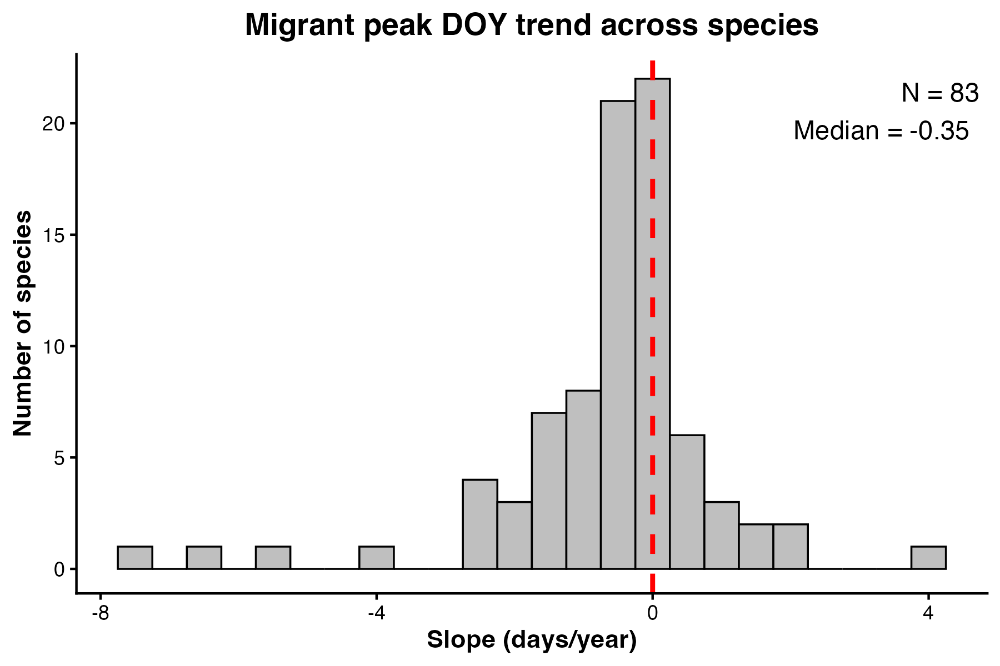
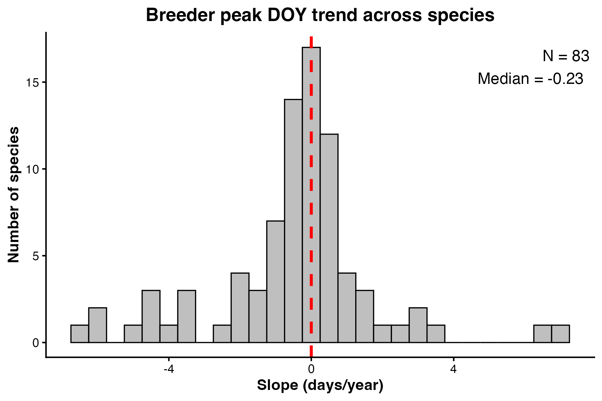

# Swiss Bird Phenology — Temporal Trends in Migration Timing (2007–2025)

Quantifies long-term shifts in spring migration and breeding phenology across ~150 Swiss bird species using overlapping 5-year windows of Swiss MHB data, fitting LOESS curves at daily resolution with Monte Carlo pentade-jitter resampling.

---

## Authors

**Swastik Mandal** — Indian Institute of Science Education and Research (IISER), Pune  
*(analysis and scripts)*

**Nicolas Strebel** *(contributor)* — Swiss Ornithological Institute  
*(data access, conceptual input)*

---

## Table of Contents

1. [Background](#background)
2. [Data](#data)
3. [Repository Structure](#repository-structure)
4. [Methods](#methods)
   - [Rolling Window Design](#1-rolling-window-design)
   - [Site Classification and SOPM](#2-site-classification-and-sopm)
   - [LOESS Fitting at Daily Resolution](#3-loess-fitting-at-daily-resolution)
   - [Trend Extraction](#4-trend-extraction)
   - [Cross-Species Summary](#5-cross-species-summary)
5. [Results](#results)
6. [Requirements](#requirements)
7. [Reproducing the Analysis](#reproducing-the-analysis)

---

## Background

Many migratory birds are shifting their arrival and departure timing in response to climate change. This project tracks how the peak timing of migrants and breeders has changed over nearly two decades (2007–2025) in Switzerland. By analysing 15 overlapping 5-year windows, it captures a smooth temporal trajectory of phenological change per species and tests whether migratory and breeding populations are shifting at different rates — a question with implications for phenological mismatch and population dynamics.

---

## Data

| File | Description |
|---|---|
| `bb_doy.csv` | Per-species EURING IDs, names, and expert reference dates |
| `phenology_peak_slopes.csv` | Cross-species summary of migrant and breeder peak-DOY trend slopes |
| `databb.csv` | Raw Swiss MHB count data — **not included** (proprietary; contact the Swiss Ornithological Institute) |

---

## Repository Structure

```
swissdata_phenology/
├── bb_doy.csv                    # Species reference dates
├── phenology_peak_slopes.csv     # Cross-species slope summary (migrant + breeder slopes)
├── histogram_breeder_slope.png   # Distribution of breeder peak-DOY trends
├── histogram_migrant_slope.png   # Distribution of migrant peak-DOY trends
├── phenologymc.r                 # Step 1 — per-species rolling-window analysis
├── phenologymc2.r                # Step 1 (variant) — alternative parameterisation
├── slope_summary.r               # Step 2 — compile slopes across species
├── plot_slopes.r                 # Step 3 — plot slope distributions
└── species_phenology/            # Per-species plots and CSVs (83 species)
    └── [SpeciesName]/
        ├── [SpeciesName]_[window].png         # LOESS curve for each of the 15 windows
        ├── [SpeciesName]_trend.png             # Peak DOY vs. mid-year with trend line
        └── [SpeciesName]_phenology_shifts.csv # Peak DOY per window, slopes, and CIs
```

---

## Methods

### 1. Rolling Window Design

**Script:** `phenologymc.r`

The dataset spans 2007–2025. The analysis uses 15 overlapping 5-year windows, starting at each year from 2007 to 2021 (e.g., 2007–2011, 2008–2012, …, 2021–2025). Each window is treated as an independent phenological snapshot. The midpoint year of each window (start year + 2) is used as the x-axis coordinate when fitting temporal trends.

---

### 2. Site Classification and SOPM

**Script:** `phenologymc.r`

Within each window, sites are classified as breeding or non-breeding using atlas codes (breeding: max atlas code > 4 or == 50), with a 5 km spatial buffer excluding non-breeding sites near confirmed breeding sites. OPM and SOPM are then computed as in the migration analysis.

---

### 3. LOESS Fitting at Daily Resolution

**Script:** `phenologymc.r`

Rather than fitting LOESS directly to pentade-aggregated counts, within-pentade timing uncertainty is propagated using Monte Carlo resampling. For each of 250 iterations, each observation is assigned a random day within its pentade (uniform draw over the 5-day interval). LOESS (span = 0.2) is then fitted to the resulting daily-resolution data. Predictions are averaged across all 250 iterations, yielding a smooth mean curve at daily resolution.

Peak DOY is extracted from the mean prediction for both the migrant and breeder curve in each 5-year window.

---

### 4. Trend Extraction

**Script:** `slope_summary.r`

For each species, a linear model is fitted to the sequence of peak DOY values across the 15 windows, separately for migrants and breeders:

```
Peak DOY ~ mid-year of window
```

The slope (days yr⁻¹) captures the rate of phenological change. 95% confidence intervals and R² are extracted and reported per species.

---

### 5. Cross-Species Summary

**Script:** `plot_slopes.r`

Histograms of migrant and breeder slopes across all species are plotted, allowing comparison of the overall direction and magnitude of phenological change across the community.

---

## Results

|  |  |
|---|---|
| Migrant peak DOY trend (days yr⁻¹) | Breeder peak DOY trend (days yr⁻¹) |

Cross-species slope summaries are compiled in `phenology_peak_slopes.csv`.

---

## Requirements

- R (≥ 4.0)
- R packages: `tidyverse`, `broom`

```r
install.packages(c("tidyverse", "broom"))
```

---

## Reproducing the Analysis

```
Rscript phenologymc.r      # Per-species rolling-window analysis → species_phenology/
Rscript slope_summary.r    # Compiles phenology_peak_slopes.csv
Rscript plot_slopes.r      # Plots histogram_breeder_slope.png and histogram_migrant_slope.png
```
